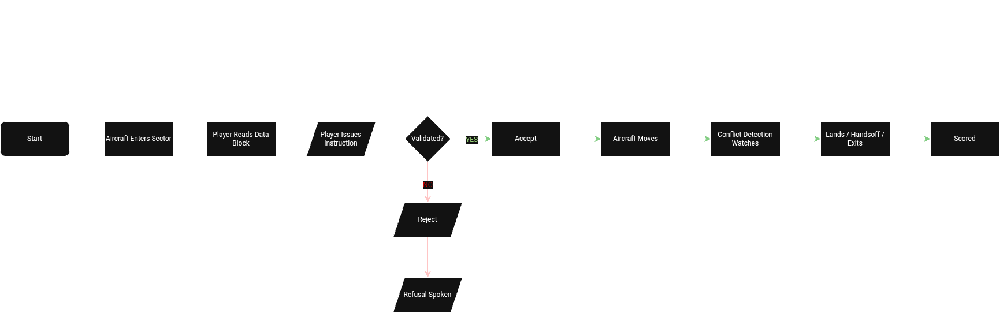

# Systems Design

**Project:** CLEARANCE
**Author:** Abdullah Ameed Abduljabbar
**Role:** Systems Designer

## Table of contents

- [Project overview](#project-overview)
- [The design emphasises](#the-design-emphasises)
- [Core gameplay loop](#core-gameplay-loop)
- [Design principles](#design-principles)
- [Planned vs production evolution](#planned-vs-production-evolution)
- [Systems list](#systems-list)
- [Airspace Management System](#airspace-management-system)
- [Aircraft Behaviour System](#aircraft-behaviour-system)
- [Communication System](#communication-system)
- [Conflict Detection System](#conflict-detection-system)
- [Scoring and Assessment System](#scoring-and-assessment-system)
- [Aircraft Spawner](#aircraft-spawner)
- [Scenario Runner](#scenario-runner)
- [Sensor Layer](#sensor-layer)
- [Electronic Warfare](#electronic-warfare)
- [Emergency and Contingency Handling](#emergency-and-contingency-handling)
- [Session Recorder and Replay](#session-recorder-and-replay)
- [Checkpoint](#checkpoint)
- [After-Action Report](#after-action-report)
- [Networked Instructor Station](#networked-instructor-station)
- [Federation](#federation)
- [Simulation controller tick pipeline](#simulation-controller-tick-pipeline)
- [References](#references)

## Project overview

CLEARANCE is a first-person air traffic control simulator built in Unreal Engine 5, targeted at civil/defence-relevant sector-control training scenarios. The player runs the sector for EGNO Warton, sequencing arrivals against wind-selected runways, handing off transits, resolving conflicts, and managing emergencies while an instructor watches from a second connected station.

The design goal is cognitive fidelity, not aerodynamic realism. Aircraft respond to instructions on realistic timescales; conflicts escalate through a three-level alert ladder; wake separation follows ICAO Doc 4444; and emergencies are designed to create comparable procedural pressure by limiting the operator to representative ATC tools. The simulator is not a pilot trainer and does not attempt to be.

CLEARANCE is a portfolio demonstrator and training-simulation prototype, not an operationally validated ATC or military training product. The project demonstrates architecture, integration, cognitive-fidelity design, verification discipline, and instructor workflow rather than certified training effectiveness.


The scope splits into five interlocking systems, each with a single defined responsibility, plus a set of supporting systems that were added during production once the core loop was stable. Everything communicates through delegates. State has one owner. Movement has one executor. Safety analysis is read-only. Instructions are validated before they can move anything.

### The design emphasises

- Systemic interactions between the Airspace Management, Aircraft Behaviour, Communication, Conflict Detection, and Scoring systems, driven by a shared event map rather than direct cross-calls.
- A simulation that produces genuine cognitive pressure consistent with real ATC decision-making. Aircraft do not teleport, traffic continues to evolve while the operator decides, and instructions have consequences once accepted into the simulation.
- Physics-constrained aircraft behaviour including bank-limited turns, category-specific climb rates, wake turbulence separation from the ICAO matrix, wind drift on ground track, service ceilings, and speed envelopes.
- A geospatial reconstruction of the actual EGNO airfield built on Cesium 3D tiles. Approach corridors, runway thresholds, and headings match the real airfield to the extent public data permits.

### Core gameplay loop

1. An aircraft enters the sector at the outer boundary and appears on the scope.
2. The player reads the data block: callsign, flight level, ground speed, heading, phase, wake category, and any active emergency.
3. The player issues an instruction over voice (push-to-talk) or the console. Heading, altitude, speed, approach clearance, handoff, or emergency-specific commands.
4. The Communication System validates the instruction against current aircraft state. Physically impossible or unsafe instructions are rejected with a spoken reason.
5. The Aircraft Behaviour System executes the accepted instruction gradually. Bank angle, climb rate, and wake corridor are all enforced during execution.
6. The Conflict Detection System monitors every pair on every tick. When separation drops through Advisory, Warning, and Critical thresholds, the operator sees graded alerts. At Critical, a simulated TCAS-style Resolution Advisory fires and splits the pair vertically.
7. The aircraft lands, is handed off to an adjacent sector, exits the boundary, or fails one of the above and is scored accordingly.
8. Difficulty scales up on success and backs off on failure. The next aircraft enters.

The loop can also be driven by a scripted scenario in place of the free-play spawner. Seven scenarios ship: Baltic Intercept, Hijack Response, Mass Divert, Mayday Engine Fire, NORDO Inbound, Cold War Probe, and Mixed Ops. Each authors traffic, weather, emergencies, and voice injects on a timeline.



*Figure 1: Core gameplay loop showing aircraft entry, operator instruction, validation, movement, conflict monitoring, scoring, and loop continuation.*

### Design principles

Six principles shape the whole codebase. They are enforced by class boundaries, not by convention. Every system in this document is a specific application of one or more of them.

1. **Single source of truth.** The Airspace Management System owns every aircraft's state. Nothing else stores a second copy. Every read is a getter. Every write is a controlled request. The map is private.
2. **Single movement executor.** Every aircraft has one Aircraft Behaviour object. That object is the only thing in the simulation permitted to change position, altitude, speed, or heading. Nothing else touches those fields.
3. **Read-only safety analysis.** The Conflict Detector reads snapshots and broadcasts events. It never mutates anything. Reactions to its events (go-arounds, RA vertical splits, scoring log entries, operator alerts) happen elsewhere.
4. **Validate before execute.** Every instruction the player issues is checked by a stateless Instruction Validator against current aircraft state before it reaches the behaviour object. Rejected instructions produce a spoken negative readback and never touch the sim.
5. **Controller-driven tick.** The Simulation Controller drives the order every frame. Spawner, behaviour, conflict, scoring, sensor, replication, presentation. Nothing else has independent tick authority.
6. **Strict presentation boundary.** Simulation logic lives in C++. Presentation is exposed through Blueprint/UMG and C++ widget paint hooks. Blueprint reads through BlueprintCallable getters and sends user intent through C++ RPCs; it does not own or mutate simulation state. If the entire UMG layer were deleted, the simulation would still run correctly with no display.

## Planned vs production evolution

The five original systems on paper were Airspace Management, Aircraft Behaviour, Communication, Conflict Detection, and Scoring. Everything else in the table below was added only after the core loop stabilised, each because a training or integration need appeared: a sensor layer for operator vs truth-scope separation, electronic warfare for degraded-picture decision-making, session recorder and checkpoint and After-Action Report for the instructor workflow, and federation for interoperability with peer simulators.

## Systems list

| System | Purpose | Depends on |
|---|---|---|
| Airspace Management | Owns and tracks all aircraft state as the single source of truth. Owns sector environment (wind, active runway). | none (root of the graph) |
| Aircraft Behaviour | Executes movement gradually with performance-constrained flight dynamics. One per aircraft. Optional Simulink autopilot handoff. | Airspace Management |
| Communication | Validates and routes player instructions. Handles voice input, phraseology parsing, pilot readback TTS. | Airspace Management, Aircraft Behaviour, Instruction Validator |
| Conflict Detection | Continuously monitors all aircraft for separation, trajectory, wake, and vertical violations. Fires graded alerts and TCAS RAs. | Airspace Management (read only) |
| Scoring | Tracks performance, logs incidents with timestamps, scales difficulty, exports After-Action Reports. | Airspace Management, Conflict Detection, Communication |
| Aircraft Spawner | Introduces aircraft into the sector at controlled cadence. Free-play mode; scenario runner takes over when a scenario is loaded. | Scoring (for difficulty), Airspace Management |
| Scenario Runner | Executes authored JSON scenarios: spawn schedules, weather changes, emergencies, voice injects, EW actions. | Airspace Management, Communication, Scoring |
| Sensor Layer | Radar sites paint tracks. Each site produces `FRadarTrack` entries against a target list. Analytic radar-equation path and optional Simulink DSP path. | Airspace Management (read only) |
| Electronic Warfare | Jamming, chaff clouds, ghost tracks. Modulates radar confidence per aircraft and per site. | Sensor Layer, Airspace Management |
| Emergency Handling | Owns emergency lifecycles: 7500 (hijack), 7600 (NORDO), 7700 (mayday), FuelLow, GeneralMayday. Countdown timers, escalation, voice broadcasts. | Airspace Management, Communication, Scoring |
| Session Recorder & Replay | Captures per-tick snapshots and event log. Replay poses the world at any timestamp. Scrub, speed control, seam marking. | Airspace Management (read only) |
| Checkpoint | Snapshots the whole sector into a named save. Load restores every aircraft, wind, and score. | Airspace Management, Scoring, Scenario Runner |
| After-Action Report | On demand, writes a Markdown report of the session with timeline, critical incidents, and transcript. | Scoring, Session Recorder, Communication |
| Networked Instructor Station | Server-authoritative replication so a second operator (the instructor) joins the running session and injects events. | Simulation Controller, all systems above |
| Federation | Publishes sim state to DIS, DDS, RTI Connext, and HLA. Subscribes to peer sims through the same integration seam. | Airspace Management (delegate subscriber) |

Each of the newer systems is described in the same shape as the core five (description, purpose, rationale, boundaries, inputs, outputs, edge cases, success criteria), with the length matched to actual complexity.

## Airspace Management System

### Description

Stores, updates, and provides read access to every aircraft's state within the controlled sector. Receives position and intent data when aircraft register through the spawner, scenario runner, or a federated peer. Accepts state commits from each aircraft's behaviour object at the end of that object's per-tick step. Responds to read requests from every other system in the simulation.

Also owns sector environmental state: wind direction, wind speed, active runway. When wind shifts past a defined crosswind threshold, the active runway automatically flips and every dependent system receives an `OnRunwayChanged` broadcast.

### Purpose

Centralise all aircraft state under one authoritative owner. Every system that reads aircraft state reads from this one place. Every system that writes to aircraft state writes through the one sanctioned entry point (`RequestStateUpdate`). No other class holds a private copy.

### Rationale

The alternative was distributed ownership: Conflict Detection maintains its own aircraft cache, Scoring maintains its own, the radar display maintains its own, and each keeps itself in sync somehow. That falls apart the moment two systems disagree about where an aircraft is. Conflict Detection misses a violation because it read stale data. The radar shows an aircraft in one position and the validator rejects a heading change because it thinks the aircraft is somewhere else. The player watches the simulation come apart.

Centralising the state eliminates that class of bug outright. There is nothing to synchronise because there is only one copy. Instruction validation always reads current state. Conflict Detection always reads current state. The replicated aircraft array (which clients see) is a downstream mirror of the same one map. When it says an aircraft is at flight level 210, every consumer in the sim sees flight level 210.

The cost is a central dependency: if the Airspace Manager is broken, the entire sim is broken. That cost is acceptable because the class is small, well-tested, and rarely edited. The benefit is that every other system in the codebase is simpler because it has one place to look for the truth.

### System boundaries

| Responsible for | Not responsible for |
|---|---|
| Storing and updating all aircraft state (position, altitude, speed, heading, callsign, phase, wake category, threat class, jamming state, emergency state) | Rendering the radar (UI layer) |
| Providing an authoritative snapshot to every reader | Deciding whether a separation violation has occurred (Conflict Detection) |
| Registering and deregistering aircraft on entry and exit | Deciding what instruction to issue (Communication) |
| Owning sector environmental state (wind, active runway, available runways, crosswind limit) | Executing aircraft motion (Aircraft Behaviour) |
| Broadcasting registered / deregistered / state-updated / runway-changed events | Scoring or difficulty scaling |
| Validating that a state update request is structurally sane before applying it | Persistent save storage (Session Recorder, Checkpoint) |

### Dependencies

| System | Interaction |
|---|---|
| Simulation Controller | Owns the Airspace Manager actor lifecycle. Calls it during the tick sequence. |
| Aircraft Behaviour | Sends one `RequestStateUpdate` per aircraft per tick. |
| Communication | Reads current state for instruction validation. Never writes. |
| Conflict Detection | Reads a full snapshot every monitoring cycle. Never writes. |
| Scoring | Reads state during event handlers to record phase transitions. Never writes. |
| Radar Display / UI | Reads via BlueprintCallable getters each frame. |
| Session Recorder | Reads per-tick snapshots for replay capture. |
| Federation | Subscribes to `OnAircraftStateUpdated` and publishes wire packets. |

### Interface table

| Source | Trigger | Call | Data | Response | Outcome |
|---|---|---|---|---|---|
| Aircraft Behaviour | End of behaviour tick | `RequestStateUpdate` | Full `FAircraftState` snapshot | Accepted / rejected | State stored, replication mirror rebuilt, `OnAircraftStateUpdated` broadcast |
| Aircraft Spawner or Scenario Runner | Aircraft enters sector | `RegisterAircraft` | Callsign, entry position, entry altitude, entry speed, entry heading, wake category, initial phase, threat class | Accepted / rejected | Aircraft added to map, `OnAircraftRegistered` broadcast, per-aircraft behaviour object created |
| Any system | Reading current state | `GetAircraftState(callsign)` | Callsign | Copy of `FAircraftState` (with `bIsValid = false` if unknown) | Consumer gets a stable snapshot |
| Any system | Iterating all aircraft | `GetAllAircraftStates` | none | Array of `FAircraftState` | Consumer sees the whole sector |
| Wind change | Crosswind exceeds threshold on current active runway | `RecalculateActiveRunway` | none (internal) | New active heading | Runway swaps, `OnRunwayChanged` broadcast to camera overlay, approach picker, aircraft on approach |

**Flowchart 2: Aircraft registration flow** (architecture sketch)

```
   Spawner or Scenario Runner
             |
             v
       RegisterAircraft
             |
             v
       stored in TMap
             |
             v
     OnAircraftRegistered
             |
             v
   controller creates behaviour
             |
             v
     Initialise() sets targets
```

**Flowchart 3: State update flow, per tick** (architecture sketch)

```
   Simulation Controller tick
             |
             v
   Behaviour reads current state
             |
             v
     Applies pending target
             |
             v
     Integrates one frame
             |
             v
       RequestStateUpdate
             |
             v
     stored + broadcast to subscribers
```

**Flowchart 4: Aircraft deregistration flow** (architecture sketch)

```
   Aircraft: exits / lands / crashes
             |
             v
     phase set on aircraft
             |
             v
   controller CheckExits catches it
             |
             v
       DeregisterAircraft
             |
             v
   OnAircraftDeregistered broadcast
             |
             v
   behaviour destroyed, scoring logs
```

### Edge cases

| Scenario | System response |
|---|---|
| Update received for an unregistered callsign | Rejected. State never applied. |
| Two systems attempt to update the same aircraft in the same tick | Impossible by construction: only the aircraft's behaviour object calls `RequestStateUpdate`, and it does so exactly once per tick from the controller-driven order. |
| Out-of-order or stale update | Behaviour objects always read fresh state at the start of their step and commit at the end, so ordering is guaranteed by the tick pipeline. |
| Query during active update | Reads return the last fully committed state. Reads are copies, so no partial exposure. |
| Aircraft exits sector without a handoff | Behaviour marks phase as `Exiting`, controller calls `CheckExits`, Airspace deregisters and broadcasts. Scoring picks up the unresolved-exit event. |
| Query before any aircraft register | Returns an empty array. Every dependent system handles empty gracefully. |
| Wind hovers around the crosswind boundary | A hysteresis dead-band prevents the runway from flipping every tick. Only flips when the choice would meaningfully change. |

### Success criteria

1. Every aircraft that enters the sector is immediately visible to every dependent system.
2. Every state read returns the same value everyone else sees for the same tick.
3. No system can bypass `RequestStateUpdate` to mutate aircraft state.
4. The radar renders positions and altitudes that match what the Conflict Detector uses.
5. Aircraft phase transitions produce exactly one deregistration event on exit.
6. Active runway matches the wind. If the wind flips, the runway swaps once and every downstream consumer updates.

## Aircraft Behaviour System

### Description

One `UClearanceAircraftBehaviour` object exists per registered aircraft, held by the Simulation Controller in a `TMap<FName, UClearanceAircraftBehaviour*>`. The controller ticks each object in dependency order. On each tick, the behaviour object reads the aircraft's current state from the Airspace Manager, applies any pending instructions, integrates one frame of motion under performance-constrained flight dynamics, and commits the updated state back through `RequestStateUpdate`.

Two motion paths exist. The default is the built-in analytic path: heading, altitude, speed, and position each step under their own axis logic. The optional path is the Simulink cascade autopilot: state is packed into an input struct, `autopilot_step` runs the generated C, control-surface commands come back, and those commands drive bank rate, climb rate, and throttle. The interface between the behaviour object and the rest of the sim is identical either way.

### Purpose

Act as the sole executor of aircraft motion. Every heading turn, every climb, every deceleration in the sim runs through this class. No other system touches position, altitude, speed, or heading. The rest of the sim commands what should happen through validated instructions; this class decides how it happens frame by frame.

### Rationale

The alternatives considered were: a fixed state machine per aircraft with predefined transitions, distributed movement (Communication and Conflict both apply movement changes directly), direct position mutation (systems write into state whenever they want), and full aerodynamic simulation with thrust, drag, and lift modelled.

Fixed state machines are too rigid for a sim where the player must be able to command any heading, altitude, or speed at any time. Distributed movement produces racing writes and desynchronised aircraft. Direct mutation breaks the cognitive fidelity because aircraft teleport instead of fly. Full aerodynamic simulation is unnecessary for an ATC perspective because the player never sees stick inputs; they see heading vectors and altitude assignments and expect gradual response.

The gradual-instruction-execution approach in the middle is what real ATC training simulators use. It gives the player realistic response to their commands, preserves the ownership boundary, and scales to the aircraft counts the sim needs (peaks in the low tens).

### Flight dynamics implementation

Motion is driven by simplified flight dynamics constrained by per-category performance limits, not by keyframed animation and not by full aerodynamics. Each aircraft carries an effective performance envelope resolved from its wake category and its military flag.

| Physics element | Implementation | Effect on the sim |
|---|---|---|
| Turn rate | Coordinated turn kinematics: `omega = g * tan(phi) / V`. Bank angle capped by category (25° for civil airliners, 30° for Light, 80° for military). | Turn radius scales with airspeed. A heavy at 300 kt turns wider than a light at 150 kt. The player has to lead vectors accordingly. |
| Bank angle | Command-limited by the autopilot. Analytic path steps directly to the commanded target within the bank rate. Simulink path integrates from aileron. | Aircraft roll into and out of turns visibly rather than snapping heading. |
| Climb rate | Density-adjusted: `MaxClimbRate * ISADensityRatio(altitude)`. Base rate per category (Medium 1800 fpm, Heavy 2500 fpm, Light 730 fpm, Super 1500 fpm). | Aircraft climb slower at altitude. Service ceiling emerges naturally rather than being clamped arbitrarily. |
| Descent rate | Flat per category (Medium 3000 fpm, Heavy 3500 fpm). Faster than climb because gravity does the work. | Realistic descents let the player plan step-down profiles. |
| Speed envelope | Clamped to `[MinOperatingSpeed, MaxOperatingSpeed]` per category, per tick. Medium is [150, 340] kt. Heavy is [170, 350]. Fighter (military) is [180, 1050]. | Player cannot clear an aircraft below stall or above certification limits. |
| Wind drift | `Ground = Air + Wind` at each tick, ENU frame, wind vector derived from sector environment. | Aircraft on assigned heading drift with wind unless the player accounts for it. |
| Bank rate limit | Aileron output scaled by `kRollRateDegPerAileronDeg` (0.5). | Prevents wing rock; softens the Simulink autopilot's high-frequency PID jitter. |
| Captured-state gate | If heading, altitude, and speed errors are all inside tolerance, bank and climb rates zero out and the aircraft holds. | Kills numerical noise from the Simulink D-term. Removes the low-amplitude oscillation that would otherwise appear on captured state. |

The physics constants live in `Public/Core/ClearanceConstants.h`. Every category maps to a `FCategoryPerformance` struct with ceiling, min and max operating speeds, max climb and descent rates, bank limit, acceleration, deceleration, crosswind limit, and ground braking rate.

### Simulink autopilot handoff

When `bAutopilotEngaged` is true (the default), `StepWithAutopilot` runs instead of the analytic steppers. The wrapper computes outer-loop targets in C++ (heading error to bank command, altitude error to pitch command), pushes them into `FClearanceAutopilotInputs`, and calls the generated `autopilot_step`. Elevator, aileron, and throttle come back as radians per second and 0..1 throttle. These are integrated as rate commands (aileron → bank rate, elevator → climb rate change, throttle → speed rate). Bank angle is clamped to ±15° for stability. Elevator and aileron below 1° are deadbanded to zero to prevent noise feedback.

The Simulink model is generated from a MATLAB source via Embedded Coder in reusable-function packaging. Each aircraft owns one instance of the model's runtime state (`RT_MODEL_autopilot_T`) so there are no shared globals. Console commands `clearance.autopilot.engage <callsign>` and `clearance.autopilot.disengage <callsign>` toggle at runtime for A/B comparison.

### System boundaries

| Responsible for | Not responsible for |
|---|---|
| All aircraft movement: heading, altitude, speed, position | Instruction validation (that's the Communication layer's job) |
| Enforcing physics limits per category | Detecting separation violations |
| Executing approach guidance and go-arounds | Rendering flight paths on UI |
| Committing updated state to the Airspace Manager once per tick | Scoring, incident logging, difficulty scaling |
| Toggling between analytic and Simulink autopilot paths | Choosing which instruction to issue (that's the player) |

### Dependencies

- Airspace Manager: reads current state at step start, writes updated state at step end.
- Communication System: receives validated `FAircraftInstruction` queued via `QueueInstruction`.
- Conflict Detector: sends `ExecuteGoAround` when a landing pair reaches Critical during approach.
- Simulation Controller: owns the map of behaviour objects, drives the tick.
- Simulink autopilot wrapper (when engaged): computes control-surface commands.

**Flowchart 5: Instruction execution flow** (architecture sketch)

```
   Validated instruction
             |
             v
     queued on behaviour
             |
             v
   next tick: read target
             |
             v
   step axis (heading / altitude / speed)
             |
             v
     commit updated state
             |
        target reached?
        /            \
     no              yes
      |               |
   next tick     instruction complete
```

**Flowchart 6: Go-around flow** (architecture sketch)

```
   Conflict Detection: Critical on approach pair
             |
             v
     OnGoAroundRequired
             |
             v
   Comms Router receives event
             |
             v
   routes go-around to behaviour
             |
             v
       bGoingAround = true
             |
             v
     aircraft climbs 3000ft
   pilot voices "going around"
             |
             v
     rejoins pattern
```

### Edge cases

| Scenario | System response |
|---|---|
| Instruction for an aircraft that has already exited | Rejected at the validator; the behaviour object never sees it. |
| Two instructions on the same axis in the same tick | The pending queue collapses to the latest per axis. Aircraft target updates cleanly on the next step. |
| Go-around triggered on an aircraft already going around | Duplicate ignored. `bGoingAround` flag guards against re-entry. |
| Aircraft crosses the exit ring mid-manoeuvre | Phase set to `Exiting`, controller catches it in `CheckExits`, behaviour is torn down before the next tick. |
| Aircraft cannot achieve requested climb rate at altitude | Density-adjusted rate caps the effective rate. Aircraft climbs at what it can, target still stands. |
| Requested altitude above service ceiling | Rejected at the validator with `Rejected_PhysicallyImpossible`. |
| Requested speed below minimum operating speed | Rejected at the validator. |
| Simulink autopilot produces spurious output | Deadband (1° elevator, 1° aileron) and captured-state gate together kill noise. |

### Success criteria

1. Heading changes turn the aircraft at a realistic rate proportional to airspeed and bank limit.
2. Altitude changes climb or descend at category-appropriate rates that degrade at altitude.
3. Speed changes accelerate or decelerate gradually, clamped to the operating envelope.
4. Approach clearance produces a stable localiser and glide-slope capture within the corridor.
5. Go-arounds abort the approach and climb the aircraft back into the pattern.
6. State committed to the Airspace Manager each tick matches what the visual layer draws.
7. Neither the analytic path nor the Simulink autopilot path produces oscillation on captured state.

## Communication System

### Description

The transaction layer between the player and the sim. Accepts instructions from voice (push-to-talk with Whisper transcription), typed console commands, or scripted scenario injects. Runs each instruction through the phraseology parser, validates the result against current aircraft state, routes accepted instructions to the target aircraft's behaviour object, and returns a spoken pilot readback for confirmations or a spoken refusal for rejections.

Owns the transcript log: every voiced transmission and every system inject is captured with a timestamp and role tag (Pilot, Operator, System, Instructor, Tower, ACC, AWACS, GCI, ATIS, MET).

### Purpose

Provide the single interface between player intent and aircraft action. Keep instruction validation, movement execution, and state ownership separate. The Communication System does not own state and does not execute movement. It parses, validates, routes, and reports.

### Rationale

Alternatives considered: direct execution (voice or console commands modify aircraft state immediately), broadcast (one instruction applies to every aircraft), and pipelined validated dispatch (chosen). Direct execution fails because it removes the safety net; any typo or unsafe target reaches the aircraft. Broadcast fails because ATC is inherently callsign-specific.

The pipelined validated dispatch approach reflects how real ATC works. The controller keys the mic, calls the aircraft by callsign, issues the instruction, and hears the pilot read it back. If the aircraft cannot comply (it is out of the sector, radios have failed, the vector is impossible), the controller hears silence or a "unable" reply. The sim reproduces this exactly. Voice input is transcribed, parsed, validated, and either speaks back the readback or the refusal.

### Phraseology parser

Grammar based on ICAO Doc 4444 chapter 12. Not a general-purpose NLP model; a bounded parser that covers the instruction set CLEARANCE supports.

**Numbers.** Digits and spoken forms both parse. `250`, `two five zero`, and `two-five-zero` all resolve to `250`. Standard ATC pronunciations (`niner`, `tree`, `fife`, `fower`) map to their canonical digits.

**Callsigns.** Phonetic telephony (`speedbird` → BAW, `lufthansa` → DLH, `united` → UAL, `emirates` → UAE, `air france` → AFR, `viper` → VIPER, `unknown`/`bogey`/`bandit` → UNK) followed by the flight number. ICAO codes accepted directly (`BAW472`, `DLH 101`).

**Action verbs.** `turn` (heading), `climb` and `descend` (altitude), `maintain`, `speed`, `reduce speed`, `cleared` (approach or takeoff), `contact` (handoff), `expedite` (rate modifier), `go around`, `hold`.

**Emergency codes.** `7500` (hijack), `7600` (comms failure), `7700` (general emergency) parse as classification events on the target.

**Declaratives.** `declare hostile`, `declare friendly`, `declare unknown` trigger reclassification through the operator's classify action.

Anything the parser handles is documented in `Docs/PHRASEOLOGY.md`. Anything not in there is not a supported transmission.

### Voice output

Pilot readbacks and facility voices are rendered by a local TTS server (Piper primary voices, Edge TTS for facilities). The server is bundled as a standalone executable via PyInstaller so packaged builds do not require Python on the target machine.

Readbacks follow an ICAO Doc 4444 chapter 12 style: target value first, no action verb, callsign at the end. `Heading two seven zero, flight level two one zero, Speedbird four seven two`. Not `Speedbird four seven two, roger, turning left to heading two seven zero`. ATC-style readback convention.

Facility voice injects (TOWER, ACC, AWACS, GCI, ATIS, MET) use distinct voices so the operator learns to recognise "who is speaking" without needing the transcript. Each role has its own colour on the transcript display.

### Transcript

Every transmission (Pilot, Operator, System, Instructor, and the six facility roles) is appended to `Transcript` on the Simulation Controller, replicated to all clients, and displayed in the Performance tab. The transcript is capped at 500 entries, filterable by role via the dropdown, and included verbatim in the After-Action Report.


**Flowchart 7: Instruction validation flow** (architecture sketch)

```
   Voice or console input
             |
             v
     Phraseology parser
             |
             v
     Comms Router receives
             |
             v
   GetAircraftState(callsign)
             |
             v
   Instruction Validator checks:
     envelope? active? IFF?
             |
      valid?
      /       \
    no        yes
     |         |
     v         v
   speak    route to
   refusal  behaviour
             |
             v
       speak pilot readback
```

### Success criteria

1. Voice input at any of the supported phraseology forms reaches the correct aircraft.
2. Instruction rejection produces a spoken refusal with the reason.
3. Instruction acceptance produces an ICAO-format spoken readback.
4. Transcript captures every voiced transmission and every system inject.
5. Facility voices are distinct and role-coloured in the display.
6. Packaged builds render voice without a Python install on the target machine.

## Conflict Detection System

### Description

Reads a snapshot of all aircraft states each tick and runs three concurrent analyses: horizontal separation against ICAO thresholds, forward trajectory projection to catch impending losses of separation, and wake turbulence separation against the ICAO Doc 4444 category-pair matrix.

Broadcasts alerts through delegates. Fires TCAS Resolution Advisories on Critical separation with a coordinated vertical split. Never mutates aircraft state.

### Purpose

Act as the safety monitoring authority for the sector. Detect every violation, project every impending violation, and hand the information to the parts of the sim that react. Do not react. Do not mutate. Do not tick independently.

### Alert ladder

Three severity levels for horizontal separation, computed from `AlertFromSeparation(horizontalNm, verticalFt)`:

- **Advisory.** Horizontal below 8 nm, vertical below 1000 ft. Ring turns amber on the affected aircraft; event log receives an ADVISORY entry.
- **Warning.** Horizontal below 5 nm, vertical below 1000 ft. Symbol frame stomps to orange. Warning entry logged.
- **Critical.** Horizontal below 3 nm, vertical below 1000 ft. Symbol frame stomps to red. Critical entry logged. TCAS Resolution Advisory fires.

Vertical separation of at least 1000 ft (RVSM airspace minimum) clears the pair regardless of horizontal distance.

Thresholds live in `Public/Core/ClearanceConstants.h`. Changing them updates every downstream renderer and every test at once.

### Trajectory projection

If a pair is currently clear but projected to conflict within `ProjectionLookaheadSeconds` (default 60), the Advisory tier fires early. This gives the player meaningful reaction time before a real closure. Projection uses linear extrapolation of `Position + Velocity * lookahead` and `Altitude + ClimbRate * lookaheadMinutes` for each aircraft.

### Wake turbulence matrix

ICAO Doc 4444 §5.8 wake separation applied to trailing pairs on same or converging tracks inside a defined wake corridor. Values live in `Public/Core/ClearanceConstants.h`:

| Leader | Follower | Required (nm) |
|---|---|---|
| Heavy | Light | 6 |
| Heavy | Medium | 5 |
| Medium | Light | 5 |
| Heavy | Heavy | 4 |
| Otherwise | any | 3 |

When a pair drops below its required wake separation while the follower is behind the leader (`FollowerIsBehindLeader` returns true from the geometry check), `OnWakeTurbulenceAdvisory` fires and the leader's wake is treated as active on the follower. Wake intensity scales with the category weight difference and the follower's aircraft rocks visibly for the duration.

### TCAS Resolution Advisory

When a pair reaches Critical and has not already fired, the Conflict Detector broadcasts `OnTCASResolutionAdvisory`. The controller catches it, picks the higher aircraft as climber and the lower as descender (or picks deterministically by callsign if altitudes match), issues an altitude-change instruction with `bExpedite = true` to each side, and logs the RA to Scoring. The RA fires exactly once per encounter and clears when the pair is out of any conflict.

Aircraft on approach that receive a climb RA convert the instruction to a go-around: the climb has to win against the glideslope.

### Engagement pair suppression

Not every close encounter is a civilian safety violation. When both aircraft are under GCI (viper flight on intercept), when either aircraft is threat-classified or truly hostile, or when a shadow fighter is trailing a hijacked aircraft, the alert ladder is suppressed. The controller does not want the operator penalised for the intercept itself. Ordinary civilian traffic in the same volume still gets alerted.

### System boundaries

| Responsible for | Not responsible for |
|---|---|
| Continuous monitoring of every aircraft pair | Modifying aircraft state |
| Horizontal, vertical, and wake separation analysis | Issuing instructions to aircraft (that's the Comms Router acting on our events) |
| Trajectory projection for advance warning | UI rendering of alert glyphs (that's the presentation layer reading our published alert level) |
| Firing graded alerts and TCAS RAs | Scoring computations (Scoring reads our events) |
| Wake advisory broadcasts | Persistent logging (Session Recorder captures events, not us) |

**Flowchart 8: Separation check flow** (architecture sketch)

```
   Detector tick
        |
        v
   read all aircraft states
        |
        v
   for each pair:
        |
   engagement suppressed?
   /                    \
  yes                    no
   |                     |
   v                     v
 skip     compute horiz + vert separation
                         |
                         v
              also project 60s ahead
                         |
                         v
                 Level = alert threshold
                         |
                         v
              new or escalated?
              /               \
             no                yes
             |                  |
             v                  v
          nothing        broadcast OnConflictDetected
                                 |
                        Critical? -> also fire TCAS RA
```

**Flowchart 9: TCAS Resolution Advisory flow** (architecture sketch)

```
   Critical separation fires TCAS RA
             |
             v
     pick climber + descender
      (higher / lower altitude,
       tie-break by callsign)
             |
             v
     compute +1500 / -1500 targets
             |
             v
   issue AltitudeChange (bExpedite = true)
             |
             v
     behaviour objects climb / descend
             |
             v
     Scoring logs TCASResolutionAdvisory
             |
             v
   ActiveTCAS clears when pair separates
```

### Success criteria

1. When separation drops below 8 nm horizontal with less than 1000 ft vertical, an Advisory fires within the same tick.
2. Escalation from Advisory to Warning to Critical proceeds in order, no level skipped.
3. TCAS RA fires exactly once per encounter at Critical and clears on separation.
4. Wake advisories fire only for followers behind leaders inside the wake corridor.
5. Engagement pairs (GCI vs hostile, viper vs shadow) do not generate civilian alerts.
6. Trajectory projection fires Advisory before real closure violates minimums.
7. Read-only: no test can prove Conflict Detection wrote to aircraft state.

## Scoring and Assessment System

### Description

`UClearanceScoring` receives events from the sim and turns them into a running score, an incident log, and a difficulty scaling factor. Every scored event is a `FIncidentRecord` (type, aircraft, timestamp, details). The full log replicates to clients as `RepScoringLog` so the Performance tab drilldown works on every station.

### Purpose

Measure the operator's performance in a way that is auditable, reproducible, and useful for after-action review. Scale difficulty based on that measurement so that a struggling operator gets easier traffic and a competent one gets harder traffic.

### Scoring policy

Rewards and penalties are constants tuneable per session. The current defaults:

| Event | Point delta |
|---|---|
| `SuccessfulLanding` | +100 |
| `SuccessfulHandoff` | +50 |
| `SuccessfulResolution` (conflict cleared by operator instruction) | +50 |
| `SeparationLoss` | -75 |
| `UnresolvedExit` | -50 |
| `MissedHandoff` | -50 |
| `GoAroundTriggered` | -25 |
| `LateInstruction` | -10 |
| `AirspaceBust` (aircraft entered restricted airspace) | -75 |
| `MisIdentification` (operator declared hostile as friendly or vice versa) | -50 |
| `TCASResolutionAdvisory` | 0 (logged, not scored: TCAS resolved it) |
| `Crash` | -200 |

### Difficulty scaling

Every `SuccessfulHandoff` shrinks `SpawnIntervalSeconds` by `DifficultySecondsPerHandled` (default 0.5 s). Clamped at `MinSpawnIntervalSeconds`. Difficulty backs off when the operator falls behind on incidents. The spawn rate change fires `OnDifficultyAdjusted` which the Spawner subscribes to.

### Efficiency

Efficiency percentage tracks total handled aircraft against total incidents. Displayed on the HUD and included in the AAR.

### Session log

Every scored event is appended to the log with its timestamp (wall clock, replicated). The log is the source of truth for the After-Action Report generator, the Performance tab drilldown, the transcript alignment, and the critical-incident selector.

**Flowchart 10: Scoring event flow** (architecture sketch)

```
   Sim event (landing / incident / handoff / etc)
             |
             v
   Source system broadcasts delegate
             |
             v
     Scoring receives event
             |
             v
       LogIncident
             |
             v
   recalculate score + efficiency
             |
             v
     OnScoreUpdated broadcast
             |
             v
     difficulty threshold crossed?
     /                          \
    no                           yes
    |                             |
    v                             v
 nothing            adjust spawn interval
                   OnDifficultyAdjusted
```

### Success criteria

1. Every `EIncidentType` maps to the correct point delta.
2. `LogIncident` appends exactly one record per call.
3. `ResetSession` clears score, log, per-category counters, and spawn interval.
4. `SuccessfulHandoff` decreases the spawn interval by exactly `DifficultySecondsPerHandled`.
5. Spawn interval clamps at `MinSpawnIntervalSeconds` regardless of how many handoffs.
6. Efficiency returns a value between 0 and 100 regardless of the event sequence.

## Aircraft Spawner

### Description

Free-play mode. Introduces aircraft into the sector at controlled cadence. Callsigns drawn from a pool. Entry position sampled around the sector ring. Entry altitude, speed, heading, and wake category drawn from configured ranges weighted toward realistic traffic distribution (mostly Medium, some Heavy, occasional Light and Super).

Difficulty determines the spawn interval. When a scenario is loaded, the spawner suspends and the scenario runner takes over.

### Success criteria

1. Spawns occur at the interval dictated by Scoring.
2. Callsigns are unique for the session.
3. Traffic distribution reflects the configured weights.
4. Spawner suspends immediately when a scenario is loaded.

## Scenario Runner

### Description

Executes scripted scenarios authored as JSON. Each scenario is a sequence of actions keyed off elapsed simulation seconds or off airspace conditions. Seven ship in the current build:

| Scenario | What it tests |
|---|---|
| Baltic Intercept | Distributed sensor fusion, GCI doctrine, intercept geometry, hostile classification, scramble launch, lead-pursuit intercept |
| Hijack Response | 7500 injection into a five-aircraft sector, shadow fighter response, hijack radio silence |
| Mass Divert | Wind-driven active runway swap, cascading fuel emergencies at T+300 seconds, divert broadcast from Tower |
| Mayday Engine Fire | 7700 declaration, priority-traffic reroute, emergency landing sequencing |
| NORDO Inbound | Dual 7600 aircraft, lost-comms procedures, published missed-approach handling |
| Cold War Probe | Multi-bandit GCI exercise, mixed friendly and probe traffic, ADIZ boundary discipline |
| Mixed Ops | Restricted airspace planning, mixed civil and military, formation flights |

### Action set

Scenario JSON supports: `spawnAircraft`, `setHeading`, `setAltitude`, `setSpeed`, `declareHostile`, `declareFriendly`, `declareUnknown`, `activateJammer`, `dropChaff`, `injectEmergency`, `broadcastFacility`, `scrambleFighters`, `changeWind`, `forceRunway`, `forceConflict`, `forceIncident`.

### Success criteria

1. Every scenario runs to completion on a clean session.
2. Every voiced transmission in a scripted scenario matches the phraseology parser's expectations.
3. Every emergency response reaches the correct aircraft and triggers the correct autopilot script.
4. Wind and runway changes propagate through the sensor layer, camera overlay, and approach picker.

## Sensor Layer

### Description

Radar sites are placed actors in the world. Each has a range, an antenna position, a scan interval, and a detection model. The Simulation Controller iterates every enabled site on every scoring tick, calls `PaintTracks`, and each site fills its own `TMap<FName, FRadarTrack>` with what it can see.

The controller then fuses across sites (latest-paint-wins, keyed on truth callsign) into `RepOperatorTracks`, which replicates to every client. That is what the operator scope draws.

### Analytic path

Each site uses the Skolnik monostatic radar range equation to compute a detection probability given target radar cross section, transmit power, wavelength, and range. The equation lives inline in `Public/Safety/ClearanceRadarEquation.h`. The default parameters (1.4 MW peak, 34 dB antenna gains, 6 dB system loss, 3 dB noise figure, 290 K noise temperature, 1 MHz receiver bandwidth, 2.8 GHz S-band, 13 dB required SNR) approximate an ASR-9 civil surveillance radar.

Track confidence carries two values: `Confidence` (fades with time since last paint) and `PaintConfidence` (what the site saw on the last paint, before time-based fade). EW can pin `PaintConfidence` to a degraded value without the fade pass resetting it.

### Simulink path

Optional per-site. Each `UClearanceRadar` can own an `FRadarWrapper` around a Simulink-generated signal processor. The wrapper synthesises an I/Q cube from live airspace state (LFM chirp × per-element steering vectors × per-pulse Doppler phase for every aircraft, plus AWGN), calls `radar_step`, and matches CFAR detections back to source aircraft by range. Same `FRadarTrack` output; different physics underneath.

The Simulink model is generated from a MATLAB source via Embedded Coder in reusable-function packaging. The MATLAB repo carries verified kernels for each stage: LFM waveform, 8-element phased array with MVDR beamforming, matched filter pulse compression, 2D range-Doppler processing, CA-CFAR detection.

Console commands `clearance.radar.mbd.enable/disable <site>` toggle at runtime for A/B comparison.

### Coverage overlay

The instructor panel's coverage heatmap toggle renders each placed site's range disc as a soft green radial gradient. Overlapping sites blend additively. Gaps read as absence. Rendered through Slate's custom vertex API (48-segment triangle fans per disc, per-vertex alpha). Purpose is diagnostic: the instructor can see at a glance where the operator's picture has degraded coverage.


Aircraft symbols on top of the coverage layer follow MIL-STD-2525C tactical symbology: friend, hostile, unknown, and neutral each get their own frame shape and colour so affiliation reads at a glance.


### Success criteria

1. Every enabled site paints tracks each scoring tick.
2. Fused `RepOperatorTracks` matches the union of all sites' tracks, deduped by truth callsign.
3. Analytic and Simulink paths produce the same `FRadarTrack` shape.
4. Coverage overlay renders every site's range disc without banding.
5. Range and detection probability match the Skolnik equation to within numerical tolerance.

## Electronic Warfare

### Description

Two effects: onboard noise jamming and chaff dispensing. Both degrade the operator's radar picture. Neither affects god-view (truth) rendering.

### Jamming

Activated per aircraft via `clearance.ew.jam <callsign>` or the scenario runner's `activateJammer` action. Sets `bJammingOn` on the aircraft's `FAircraftState`. Every radar site paints the jamming aircraft's return at 30% confidence and drops the secondary transponder data. Operator scope shows the primary blip fading, the callsign vanishing off the data block, only a `PRI` marker in its place. Operator must positively re-identify before issuing instructions.

Only the jamming aircraft's own return is degraded. Neighbouring aircraft are unaffected. This models self-protection jamming, not stand-off jamming. Both are covered in the radar-mbd design brief for future iteration.

### Chaff

Activated per aircraft via `clearance.ew.chaff <callsign>` or the scenario runner's `dropChaff` action. Aircraft dispenses a cloud of five ghost returns clustered near the drop point. Each ghost paints as `CHAFF01` through `CHAFF05` with no transponder data. The cloud lifetime is 12 seconds; ghost confidence fades linearly.

Under the Simulink DSP path, chaff generates the same five extra I/Q contributions per site per CPI with randomised radar cross sections around the drop position.

### Gameplay integration

The Baltic Intercept and Cold War Probe scenarios both trigger EW at specific timestamps. Hostile aircraft on scenario scripts drop chaff when a friendly fighter closes inside a defined lead-pursuit distance. Operator scoring rewards resolving an intercept through the EW clutter and penalises misidentifying a chaff ghost as a real target.

The instructor sees both pictures. Truth scope reads directly off the Airspace Manager (every aircraft's real state, no sensor noise, no EW effects). Operator scope reads through the fused radar picture.


### Success criteria

1. Jamming degrades only the jamming aircraft's own return.
2. Chaff generates exactly five ghost returns for 12 seconds with linear fade.
3. Truth scope shows no EW effects.
4. Operator scope shows both.
5. Scoring records misidentification of chaff ghosts as `MisIdentification` incidents.

## Emergency and Contingency Handling

### Description

Owns the lifecycle of every declared emergency. Five types are supported:

- **7500 Hijack.** Transponder squawks 7500. Radio goes silent (NORDO-like behaviour). Shadow fighters may launch. Aircraft continues on last cleared instructions.
- **7600 Comms Failure.** Transponder squawks 7600. Aircraft flies published lost-comms procedure. No voice response to any instruction. Airspace has to be cleared around it.
- **7700 General Emergency.** Transponder squawks 7700. Pilot voices a mayday declaration over the radio. Priority landing sequence.
- **FuelLow.** Countdown timer starts at 5 minutes. Escalating urgency in voiced radio calls. Timer runs to zero if not landed, triggering a crash.
- **GeneralMayday.** Countdown timer starts at 7 minutes. Same escalation as FuelLow. Different voiced call.

Emergencies fire through `Server_InjectEmergency` on the operator player controller. The instructor can inject any type through the right-click menu on any aircraft.

### Countdown

`EmergencyTimerMinutes` on the aircraft's `FInstructorAircraftRow` is populated only when the active emergency has a countdown (FuelLow or GeneralMayday). Timer counts down in real seconds, replicates to clients, and drives the emergency panel widget's colour: red under 1 minute, amber under 3 minutes.

The instructor can override the timer at inject time (`Server_InjectEmergency(callsign, kind, timerMinutes = -1.f)`) to dial 30-second panic scenarios or 15-minute gentle-training exercises. Default -1 preserves the 5-minute fuel or 7-minute mayday values.


### Success criteria

1. Every emergency type produces the correct transponder squawk.
2. Voice injects fire at the correct times relative to the emergency lifecycle.
3. Countdown timers replicate to clients and drive the emergency panel widget.
4. Crashing aircraft (fuel timeout, mayday timeout) log a `Crash` incident to Scoring.
5. Priority landing sequences correctly clear other traffic on the same runway.

## Session Recorder and Replay

### Description

Server-authoritative. Every scoring tick, the recorder captures a snapshot of the whole airspace state (every aircraft, wind, scoring counters, transcript log, notification ring) into a ring buffer keyed by timestamp. Also captures timestamped events (scoring events, voice transmissions, notifications) into a parallel event list.

Replay mode pauses the sim, poses the world to the snapshot at the scrub position, and re-plays events between the last and current scrub position. Scrub bar in the instructor panel drives the pose.

### Segment seams

Every time the operator returns from replay to live, a seam timestamp is pushed to the scrub bar. Seams paint as tick marks on the bar so the operator can see where each live segment begins.

### Success criteria

1. `StartRecording` and `StopRecording` toggle `IsRecording` correctly.
2. `CaptureSnapshot` appends one snapshot per call while recording.
3. `FindSnapshotAt(t)` returns the most recent snapshot at or before `t`, clamping to first on negative input and last on overshoot.
4. Every field of `FAircraftState` in a captured snapshot is identical to the input at the same time.
5. `GetEventsInRange(from, to)` returns events with timestamps inclusively in `[from, to]`.
6. Buffer accumulates across replay-live cycles; seams paint at correct positions.

## Checkpoint

### Description

Instructor-only. `SaveCheckpoint(name)` captures the whole sector into a named struct: every aircraft state, wind, active runway, session time, scoring log. `LoadCheckpoint(name)` clears live traffic and re-registers from the saved payload. `DeleteCheckpoint(name)` removes a named save.

The transcript and recorder are not touched on load. Transcript keeps the full attempt history (so the AAR reflects every trainee's retry). Recorder keeps recording continuously.

Instructor UI shows a dropdown of saved checkpoints with metadata (name, session time at save, aircraft count, score at save). Payload stays server-side.

### Success criteria

1. Save captures every aircraft state, wind, and scoring counter.
2. Load restores every field exactly.
3. Multi-attempt training workflow (save at scenario start, let trainee attempt, load to reset, repeat) works without state leakage between attempts.
4. Deletion removes only the named checkpoint.

## After-Action Report

### Description

One button. Server-authoritative. Writes a full session report to `<ProjectSavedDir>/Reports/Session_YYYYMMDD_HHMMSS.md` in Markdown.

### Report shape

- **Header.** Timestamp, session duration, scenario name (if loaded), wind at start.
- **Summary.** Total handled, efficiency, successful handoffs, incidents, resolutions, intercepts, emergencies.
- **Timeline.** Chronological list of every scored event with aircraft and timestamps.
- **Critical incidents.** Automatically selected catastrophic events (MisID, Airspace Bust, Crash, Separation Loss) with the 60 seconds of comms leading up to each.
- **Score breakdown.** Operations and Incidents columns with per-category totals.
- **Full transcript.** `[mm:ss] **ROLE** Speaker: Text` for every logged transmission.

Path is resolved via `FPaths::ConvertRelativePathToFull` so the on-screen announcement shows a clickable absolute path.


### Success criteria

1. Report writes without errors after any session length.
2. Timeline matches the scoring log.
3. Critical incidents include the correct comms window.
4. Transcript renders every logged transmission in the correct role.
5. Path is absolute and clickable.

## Networked Instructor Station

### Description

CLEARANCE runs server-authoritative. The player is the operator and owns the running sim on their machine. An instructor can join as a second peer over LAN or via EOS. The instructor gets a distinct widget (the instructor station) which reads the same replicated data everyone else does, plus a set of Server RPCs for injecting events into the sim.

The instructor also drives a picture-in-picture 3D camera feed alongside the scope. Five modes: Tower, Chase, Approach, Overview, and Operator POV. Chase in particular auto-follows the selected aircraft with per-mesh offsets so the feed stays framed as the aircraft manoeuvres.


### Inject RPCs

Instructor and server-side RPCs on the operator's `AClearanceOperatorPC`. Every instructor action funnels through here. Every one is authoritative on the server and replicates its effect out to every client. The current set covers emergency lifecycle, aircraft classification, scramble launch, wind and time-scale controls, spawning and traffic clearing, scenario load/stop/reset, checkpoint save/load/delete, AAR export, and federation start/stop across DIS, DDS, RTI, and HLA.

`InjectEmergency`, `ClearEmergency`, `ClassifyAircraft`, `ScrambleFighters`, `SetWind`, `SetTimeScale`, `SetMaxAircraft`, `SpawnAircraft`, `ClearTraffic`, `LoadScenario`, `StopScenario`, `ResetScenario`, `SaveCheckpoint`, `LoadCheckpoint`, `DeleteCheckpoint`, `ExportAAR`, `StartDDS`, `StopDDS`, `StartDIS`, `StopDIS`, `HLAJoin`, `HLAResign`.

### Replicated state

`ReplicatedAircraft`, `RepScoringLog`, `RepOperatorTracks`, `RepNotifications`, `RepCheckpoints`, `Transcript`, `SectorEnvironment`, `Runways`, `ChaffClouds`, plus alert-level replicated per aircraft. Client instructor panel reads these directly through BlueprintCallable getters.

### Success criteria

1. Instructor peer joins a running session without disrupting live traffic.
2. Every inject RPC produces the same visible effect on operator and instructor.
3. State propagation between peers takes less than 200 ms on a healthy LAN.

## Federation

### Description

Publishes sim state through four interoperability stacks and subscribes from them: IEEE 1278.1 DIS, DDS via Fast DDS, DDS via RTI Connext, and IEEE 1516 HLA via OpenRTI. HLA uses an RPR-FOM 2.0 base with CLEARANCE-specific extensions for ATC-managed aircraft.

### Wire format

DIS Entity State PDUs at 5 Hz per aircraft, matching the DIS heartbeat convention. Transmitter PDU per operator radio at 5 Hz, Signal PDUs for voice, Fire and Detonation PDUs for engagement and intercept event modelling, Emission PDUs for radar operations. The DIS codecs are tested for fixed sizes, offsets, padding, round-trip behaviour, and malformed rejection, with live output verified through Wireshark's DIS dissector.

### Ownership

Federation supports two-federate live sessions with distinct Site IDs. Local aircraft are marked `OWN` on their originating federate. Peer aircraft appear on each scope with a `SITE N` chip identifying their origin. Reclassifying a peer-owned aircraft is rejected on the wrong federate.

### Integration point

The DIS emitter subscribes to `OnAircraftStateUpdated`. Every state commit becomes a wire packet. Every incoming PDU flows in through the same registration path as a local spawn (`RegisterAircraft` with `bIsExternal = true`). DDS, RTI, and HLA follow the same pattern on their respective buses. All four are toggleable live from the instructor panel with host, port, start, stop, and packet-rate indicators.


### Success criteria

Verified by 22 REQ-DIS automation tests and 6 REQ-FED tests. See [`Docs/Verification/Requirements.md`](../Verification/Requirements.md) for the full list. Manual verification via Wireshark, RTI Admin Console, and the standalone DDS and HLA subscriber processes. See [`Docs/Verification/V_AND_V_PLAN.md`](../Verification/V_AND_V_PLAN.md) MP-01 through MP-04.

## Simulation controller tick pipeline

The Simulation Controller drives every tick in a fixed order. The comment in the source calls it "the authoritative tick order from the architecture doc" and it is:

1. **Spawner and scenario injection.** If no scenario is running, ask the spawner whether to inject a new aircraft this frame. If a scenario is running, evaluate its next timed action instead.
2. **Behaviour step.** Every aircraft's behaviour object reads current state, applies pending instructions, integrates one frame, commits back to the Airspace Manager.
3. **Conflict detection.** Full snapshot analysis of horizontal, vertical, trajectory, and wake separation. Fires alerts and RAs.
4. **Alert stamping.** Every aircraft's `CurrentAlertLevel` is written back to the Airspace Manager so replication carries it to clients.
5. **Scoring and event consumption.** Scoring subscribes to conflict, phase, and instruction events fired earlier in the tick. Incidents are logged, score recalculated, difficulty threshold checked.
6. **GCI intercept and bandit EW reactions.** Joined-up viper flights track their assigned targets. Hostile aircraft under intercept respond with chaff or jammer activation.
7. **Radar paint and fusion.** Every enabled radar site paints tracks against the fresh airspace state. The controller fuses across sites into `RepOperatorTracks`.
8. **Exit and crash checks.** Aircraft crossing the boundary are handed off, exited, or scored as strayed. Aircraft in `Crashed` phase fall to the ground with the timed collapse.
9. **Replication and visual sync.** Replicated arrays (aircraft, scoring log, tracks, notifications) refresh. Instructor panel and operator HUD read the fresh state and repaint.

The order is fixed and matters. Behaviour must run before conflict, because conflict analyses the committed state. Conflict must run before scoring, because scoring logs conflict events. Radar sites run after airspace commits, because radar reads the fresh aircraft positions. Replication runs last so every client reads a consistent snapshot. Slipping any step means downstream systems read stale data.

**Flowchart 11: Tick pipeline** (architecture sketch)

```
   Simulation Controller Tick
             |
             v
   1. Spawner / scenario injection
             |
             v
   2. Behaviour step (all aircraft)
             |
             v
   3. Conflict detection
             |
             v
   4. Alert stamping
             |
             v
   5. Scoring / event consumption
             |
             v
   6. GCI intercept + bandit EW
             |
             v
   7. Radar paint + fusion
             |
             v
   8. Exit / crash checks
             |
             v
   9. Replication + visual sync
             |
             v
        next frame
```

## References

Anderson, J. D. (2016) *Introduction to Flight*, 8th ed. McGraw-Hill Education.

Gregory, J. (2014) *Game Engine Architecture*, 2nd ed. CRC Press.

IEEE (2012) *IEEE Standard for Distributed Interactive Simulation: Application Protocols* (IEEE Std 1278.1-2012). IEEE Standards Association.

ICAO (2016) *Procedures for Air Navigation Services: Air Traffic Management*, Doc 4444, 16th ed. International Civil Aviation Organization.

Laminar Research (2024) *Global ATC Simulator*. Available at: https://developer.x-plane.com

Salen, K. and Zimmerman, E. (2003) *Rules of Play: Game Design Fundamentals*. MIT Press.

Schell, J. (2015) *The Art of Game Design: A Book of Lenses*, 2nd ed. CRC Press.

SISO (2015) *Standard for Real-time Platform Reference Federation Object Model (RPR-FOM) 2.0* (SISO-STD-001-2015). Simulation Interoperability Standards Organization.

Skolnik, M. (2001) *Introduction to Radar Systems*, 3rd ed. McGraw-Hill.

Stengel, R. F. (2004) *Flight Dynamics*. Princeton University Press.

Truong, T. (2023) *Mini Airways*. Available at: https://miniairways.com
