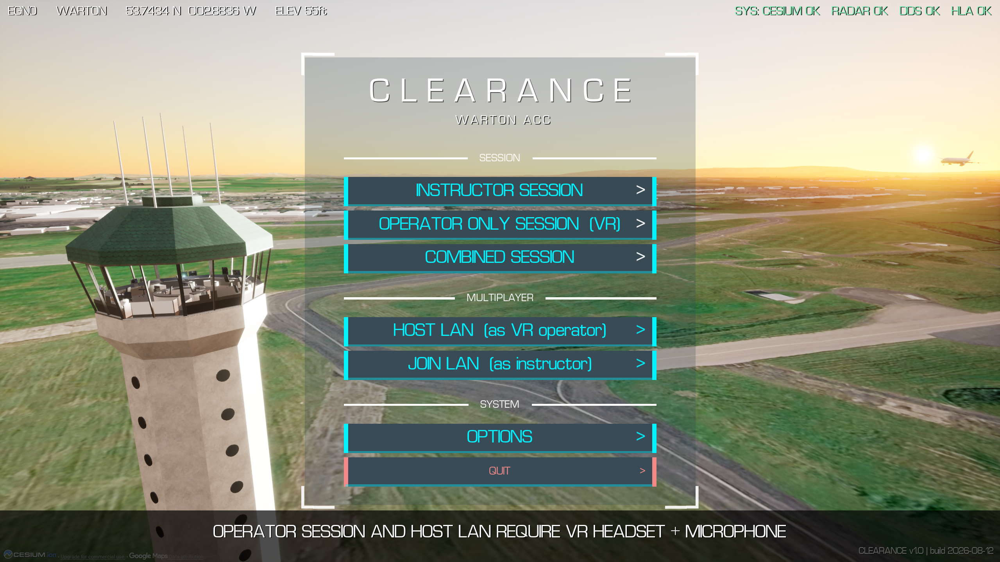
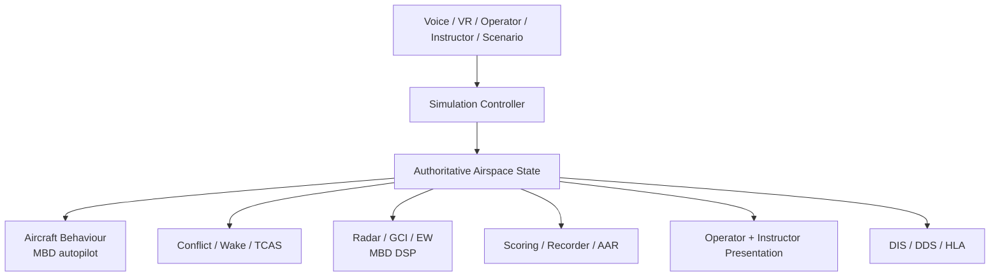

<a href="https://www.unrealengine.com/en-US/unreal-engine-5" target="_blank" rel="noopener noreferrer"></a>
<a href="https://isocpp.org/" target="_blank" rel="noopener noreferrer"></a>
<a href="https://www.microsoft.com/windows/windows-11" target="_blank" rel="noopener noreferrer"></a>
<a href="https://developer.oculus.com/documentation/unreal/unreal-engine/" target="_blank" rel="noopener noreferrer"></a>
<a href="https://www.mathworks.com/products/simulink.html" target="_blank" rel="noopener noreferrer"></a>

<a href="https://standards.ieee.org/ieee/1278.1/4949/" target="_blank" rel="noopener noreferrer"></a>
<a href="https://www.omg.org/spec/DDS/" target="_blank" rel="noopener noreferrer"></a>
<a href="https://standards.ieee.org/ieee/1516/3536/" target="_blank" rel="noopener noreferrer"></a>
<a href="Docs/Verification/V_AND_V_REPORT.md" target="_blank" rel="noopener noreferrer"></a>
<a href="Docs/Verification/Requirements.md" target="_blank" rel="noopener noreferrer"></a>
<a href="LICENSE" target="_blank" rel="noopener noreferrer"></a>

# CLEARANCE

**C++ synthetic training, distributed simulation, and Model-Based Design in Unreal Engine 5.**

<p align="center">
  
</p>

CLEARANCE is a four-month solo engineering project built between May and August 2026. A networked ATC and air defence synthetic training ecosystem implemented in C++ on Unreal Engine 5.7.

A VR operator and a desktop instructor connect over LAN as separate networked roles against one server-authoritative simulation state. The ecosystem combines aircraft simulation, radar and GCI, electronic warfare, voice interaction, scenario control, replay and after action reporting, Model-Based Design, and distributed simulation interoperability.

| | |
|---|---|
| **Scope** | Solo. Four months. Sole author. |
| **Architecture** | One authoritative simulation state, controlled subsystem ownership |
| **Federation** | DIS · Fast DDS · RTI Connext · HLA Evolved / OpenRTI |
| **Model-Based Design** | Autopilot · Radar DSP · Missile guidance |
| **Training** | VR operator · Networked instructor · Replay · Checkpoints · AAR |
| **Verification** | 52 automated tests mapped across 69 requirements |
| **Evidence** | Source · models · requirements · V&V · external interop · long-form video |

> CLEARANCE is a synthetic training and integration demonstrator. It is not certified operational ATC, avionics, or weapon system software.

## Why CLEARANCE exists

CLEARANCE began as a C++ ATC simulation and expanded into an experiment in how an interactive synthetic environment can be engineered as one coherent system rather than a collection of gameplay features.

The project prioritises explicit state ownership, ordered runtime orchestration, human-in-the-loop training, modular simulation interfaces, model-generated subsystem integration, distributed interoperability, requirements traceability, and evidence of what the implementation does and does not prove.

Cognitive fidelity and procedural decision making over certified aerodynamic, sensor, or weapon system fidelity.

## Technical evidence

The principal runtime and engineering evidence produced alongside the simulator.

| | Video |
|---|---|
| Three minute showcase | <!-- VIDEO_URL --> |
| End to end two role playthrough (v1.0 release) | <!-- VIDEO_URL --> |
| [C++ technical architecture](https://www.youtube.com/watch?v=25d2I24uIs4) | Ownership, execution order, aircraft behaviour, communications, safety, radar, instructor tooling, replay, V&V, federation, VR, and presentation boundaries walked through the source. |
| [Federation stack](https://www.youtube.com/watch?v=u7qeIkqkt4s) | DIS, Fast DDS, RTI Connext, and HLA Evolved / OpenRTI with live traffic, Wireshark decoding, standalone subscribers, FOM extension, and two-federate operation. |
| [Model-Based Design](https://www.youtube.com/watch?v=nqjFOimsYHw) | Simulink autopilot and radar DSP models, Embedded Coder output, C++ wrappers, per instance runtime state, live integration inside Unreal. |

## Architecture

At the centre of CLEARANCE is `AClearanceAirspaceManager`, the canonical owner of aircraft and environment state. Every other system in the sim consumes or acts on that state through explicitly controlled boundaries.

Six principles carry the runtime. They are enforced by class boundaries, not by convention.

1. **Single source of truth.** One authoritative airspace state owned by the Airspace Manager.
2. **Single movement executor.** Each aircraft has one behaviour component. Nothing else moves the aircraft.
3. **Read only safety analysis.** Conflict detection observes state and emits events. It never mutates aircraft state itself.
4. **Validate before execute.** Instructions pass through a stateless validator against current state before reaching behaviour.
5. **Controller driven execution.** Runtime systems execute through an explicit ordered pipeline rather than unrelated Actor ticks.
6. **Strict presentation boundary.** C++ owns simulation state. Blueprint and UMG present it and submit intent. If the whole UMG layer were deleted, the simulation would still run.



Full treatment:
- [Systems Design](Docs/Design/SystemsDesign.md) for what each system does and how they interact.
- [Technical Architecture](Docs/Design/TechnicalArchitecture.md) for ownership, tick pipeline, delegate map, lifecycle, and the C++ to Blueprint boundary.
- [C++ Scaffold](Docs/Design/CppScaffold.md) for enums, structs, and per class API surfaces.

## Two human roles, one simulation

**VR operator** works from a diegetic tower cab: VR hand and controller interaction, a physical nine button console for station wide state and PTT, world space touchscreen widgets for aircraft selection, an operator scope on a physical desk monitor, and voice driven ATC / GCI interaction.

**Desktop instructor** receives a separate truth oriented interface: truth and operator scopes, scenario and emergency injects, aircraft classification and EW controls, live PIP cameras (tower, chase, approach, overview, operator POV), simulation time controls, checkpoints, replay, performance reports, communications transcript, federation controls, and After Action Report export.

The two stations can run on separate PCs over LAN while sharing one server-authoritative simulation.

<p align="center">
  
  
</p>

<p align="center"><em>Truth scope (left) vs operator scope (right) at the same instant. What the sim knows vs what the operator sees through the sensor stack.</em></p>

## Model-Based Design

Three Simulink workflows integrated through a common generated code boundary.

```
Simulink model  →  Embedded Coder  →  portable C  →  C++ wrapper  →  per instance runtime state
```

**Aircraft autopilot.** Cascade control architecture generated to portable C. Every aircraft owns an independent model instance with reusable function packaging so no shared controller state leaks across the fleet. The Unreal wrapper handles outer heading and altitude loops, supplies live aircraft state to the generated model, and consumes the resulting surface commands.

**Radar DSP.** Eight element phased array, MVDR adaptive beamforming, matched filter, range Doppler processing, CA-CFAR detection, top target output per coherent processing interval. CLEARANCE synthesises the receive I/Q cube from live simulation state and feeds it into the generated processor. The long range surveillance profile intentionally trades unambiguous Doppler for the range the synthetic environment needs.

**Missile guidance.** A 3-DOF Simulink missile model exploring proportional navigation, acceleration limiting, point mass integration, and terminal conditions. The generated model compiles and integrates through the same wrapper pattern, but the v1.0 live missile guidance path currently uses a C++ pursuit fallback because the generated model's initial missile velocity remains coupled to its authored verification geometry. The production fix is known: expose launch state velocity as a runtime model input and regenerate. The limitation is documented rather than hidden.

Companion repositories:
- [autopilot-mbd](https://github.com/abdullahabduljabbarab/autopilot-mbd)
- [radar-mbd](https://github.com/abdullahabduljabbarab/radar-mbd)
- [missile-mbd](https://github.com/abdullahabduljabbarab/missile-mbd)

## Distributed simulation and interoperability

One canonical simulation state exposed through four independently switchable backends.

```
                    CLEARANCE authoritative state
                                 |
    +----------------+-----------+-----------+----------------+
    |                |                       |                |
   DIS           Fast DDS             RTI Connext            HLA
IEEE 1278.1        RTPS                  RTPS         IEEE 1516-2010
    |                |                       |                |
Wireshark      standalone           RTI Admin Console    OpenRTI /
third party    subscriber                                standalone
DIS tooling                                              subscriber
```

**IEEE 1278.1 DIS.** In-house byte level codec supporting Entity State, Fire, Detonation, Electromagnetic Emission, Transmitter, and Signal PDUs. UDP multicast independently inspected through Wireshark and external DIS tooling.

**OMG DDS · Fast DDS.** Typed DDS topics generated from IDL and transported over eProsima Fast DDS / RTPS. Standalone consumers provide evidence outside the Unreal process.

**OMG DDS · RTI Connext.** A second DDS vendor integration exercises the same architectural boundary. Discovered by the RTI Administration Console at runtime.

**IEEE 1516-2010 HLA Evolved.** OpenRTI integration using an RPR-FOM derived `ATCManagedAircraft` extension. A standalone HLA subscriber verifies attribute publication independently from Unreal. Cross-vendor Portico compatibility remains a documented limitation: OpenRTI accepts the current FOM composition, Portico rejects it during FDD loading. That gap is retained as engineering evidence rather than presented as solved interoperability.

The backends share canonical CLEARANCE state but do not claim identical v1.0 feature parity across every event type.

Middleware stays outside the simulation core. Transport callbacks do not directly mutate Unreal objects. Incoming middleware data is transferred through transport side queues and applied from the Unreal game thread, preserving engine thread and lifetime boundaries.

<p align="center">
  
</p>

## Independent interoperability evidence

A serializer successfully reading its own output is useful verification, but it is not sufficient interoperability evidence.

CLEARANCE therefore uses:
- Wireshark's independent DIS dissector for wire level verification
- Third party DIS tooling exchange
- Standalone Fast DDS consumers
- RTI Administration Console runtime discovery
- Standalone HLA subscribers
- Cross-process federation
- Two federate runtime tests

The [clearance-federation](https://github.com/abdullahabduljabbarab/clearance-federation) companion repository holds the wire evidence and standalone tooling separately from the Unreal project.

## Verification and validation

Requirements led verification connecting implementation claims to explicit evidence. **52 automated tests** mapped across **69 requirements** covering seven domains.

| Domain | Example evidence |
|---|---|
| DIS | PDU length, field mapping, round trip, malformed input |
| Federation | Ownership and protocol field mappings |
| Communications | Instruction acceptance and rejection |
| Safety | Separation, wake, and performance constraints |
| Scoring | Incident and session behaviour |
| Simulation | Recorder and replay behaviour |
| Radar | Radar equation and detection calculations |

Every automated requirement is mapped to the test that verifies it. Automation is supplemented by manual runtime and interoperability procedures using independent processes and external tooling.

Full material:
- [Docs/Verification/Requirements.md](Docs/Verification/Requirements.md), 69 requirements traced to their verifying tests
- [Docs/Verification/V_AND_V_PLAN.md](Docs/Verification/V_AND_V_PLAN.md), verification strategy, test tiers, manual procedures
- [Docs/Verification/V_AND_V_REPORT.md](Docs/Verification/V_AND_V_REPORT.md), verification results at the shipped build

**What this evidence does not prove.** CLEARANCE does not claim formal independent V&V, operational ATC validation, weapon system fidelity, safety certification, full standards conformance from unit testing alone, or production-level assurance. The purpose is to demonstrate requirements led engineering discipline proportionate to a portfolio simulation demonstrator.

## Training evidence

**Record. Rewind. Retry. Review.** A full session recorder captures simulation snapshots and events. Instructor replay poses the world to earlier recorded states, scrubs through time, pauses, and replays at different speeds.

**Checkpoints** provide a separate training workflow: an instructor can save state immediately before a critical event, allow a trainee to attempt it, then restore the same state for another attempt without destroying wider session history.

After each session, CLEARANCE exports a Markdown After Action Report containing performance totals, incident chronology, critical event communications context, score breakdown, and the complete communications transcript.

<p align="center">
  
</p>

<p align="center"><em>Instructor PIP camera in chase mode, tactical overlay drawn on top of the world feed.</em></p>

## Capability surface

The runtime capabilities supported by the v1.0 simulation ecosystem.

**Simulation core**
- Cascade PID autopilot flying every aircraft, one instance per aircraft with reusable function packaging.
- Physics constrained aircraft behaviour: bank limited turns, category specific climb rates, wake turbulence separation from the ICAO Doc 4444 matrix, wind drift on ground track, service ceilings, speed envelopes.
- Conflict detection with a three level alert ladder (Advisory, Warning, Critical) and a TCAS style Resolution Advisory that splits pairs vertically at Critical.
- Aircraft spawner with sector entry pacing and difficulty scaling driven by operator success and failure.

**Sensor stack**
- Pulsed radar signal processor with MVDR beamforming, matched filter, range Doppler, CA-CFAR, top target output per CPI. One instance per radar site.
- Multi radar fusion with per aircraft coverage evaluation.
- Radar coverage heatmap exposing coverage gaps and multi-site overlap to the instructor.
- Electronic warfare: self-jamming that degrades a single aircraft's return, and chaff bursts that bloom into primary-only ghost returns and fade over roughly eight seconds.

**Weapons**
- Vertical launch surface to air missile with boost, pitchover, and terminal guidance.
- SAM engagement fires against selected hostile tracks under instructor control. See the Model-Based Design section for the current live guidance path.

**Comms**
- Offline speech recognition through a bundled whisper.cpp server, auto launched by the game.
- Speech synthesis through Piper voices, with an optional Edge TTS fallback for extra voice colour.
- Real ATC phraseology parser: heading, altitude, speed, approach clearance, handoff, emergency responses, all with readbacks. Instructions the aircraft cannot execute come back with a spoken reason.
- Ten role coloured transcript covering Operator, Pilot, System, Instructor, Tower, ACC, AWACS, GCI, ATIS, and MET lines.

**Roles and networking**
- VR operator: diegetic tower cab, world space touchscreen widgets, fingertip touch interaction (no laser pointers), operator scope on a physical desk monitor, nine button physical console for station wide state and PTT.
- Desktop instructor: full scope, scenario injects, live aircraft scrub, PIP cameras (tower, chase, approach, overview, operator), transcript, performance tab, score report, federation controls.
- LAN two machine play with direct IP join. Host and join dialogs on the main menu.

**Tooling**
- Full session recorder and replay with scrub bar and playback speed control.
- Checkpoint save and restore for scenario rehearsal.
- After Action Report exported as Markdown.
- In station reference wiki accessible to the operator during a session.

**World**
- Cesium streamed real world terrain. Demo build at Warton airfield (EGNO), with runway thresholds and approach corridors matched to the real airfield to the extent public data permits.
- Seven authored training scenarios: Baltic Intercept, Hijack Response, Mass Divert, Mayday Engine Fire, NORDO Inbound, Cold War Probe, Mixed Ops.

## Known limitations

CLEARANCE deliberately remains a portfolio-scale demonstrator. The engineering surface is intentionally exposed rather than hidden.

- Missile MBD guidance is integrated but does not currently drive the live v1.0 guidance path, because launch state velocity remains coupled to the authored verification geometry. The production fix is known and documented.
- HLA / OpenRTI operation is demonstrated; Portico currently rejects the composed FOM during FDD loading. That gap is retained as evidence rather than presented as solved interoperability.
- Radar fusion is deliberately lightweight rather than a full probabilistic multi sensor tracker.
- Tier 2 automated UWorld integration coverage remains less developed than the pure unit automation baseline.
- Training behaviour has not undergone independent SME or operator validation.
- No claim of operational, safety-critical, or certified defence fidelity is made.

## Documentation

**Systems design**

| Document | Purpose |
|---|---|
| [Docs/Design/SystemsDesign.md](Docs/Design/SystemsDesign.md) | Main systems design: overview, gameplay loop, every system in the sim. |
| [Docs/Design/TechnicalArchitecture.md](Docs/Design/TechnicalArchitecture.md) | Runtime architecture: class ownership, tick order, delegate map, lifecycle, networking. |
| [Docs/Design/CppScaffold.md](Docs/Design/CppScaffold.md) | Class-level API surfaces: enums, structs, per-system function breakdown. |
| [Docs/Design/ScenarioDesign.md](Docs/Design/ScenarioDesign.md) | The seven training scenarios: intent, spawn plans, injects, success and failure criteria. |
| [Docs/Design/VoicePipeline.md](Docs/Design/VoicePipeline.md) | Comms: whisper.cpp STT, phraseology parser, validator, Piper / Edge TTS, role-coloured transcript, packaging. |
| [Docs/Design/CesiumAndCoordinateFrame.md](Docs/Design/CesiumAndCoordinateFrame.md) | Cesium mirror convention, oblique-heading runway dimensions, terrain streaming, VR performance envelope. |
| [Docs/Design/ReplayAndAAR.md](Docs/Design/ReplayAndAAR.md) | Session recorder, replay and scrub, checkpoints, Markdown After Action Report. |

**Planning**

| Document | Purpose |
|---|---|
| [Docs/Planning/MVP.md](Docs/Planning/MVP.md) | MVP scope, in and out, build priority order, definition of done. |
| [Docs/Planning/RiskRegister.md](Docs/Planning/RiskRegister.md) | R1 through R18 risks with mitigations. |
| [Docs/Planning/TestPlan.md](Docs/Planning/TestPlan.md) | Test strategy, per-system tests, end-to-end scenarios, release gate checklist. |

**Verification**

| Document | Purpose |
|---|---|
| [Docs/Verification/Requirements.md](Docs/Verification/Requirements.md) | 69 requirements traced to their verifying tests. |
| [Docs/Verification/V_AND_V_PLAN.md](Docs/Verification/V_AND_V_PLAN.md) | Verification strategy, test tiers, manual procedures. |
| [Docs/Verification/V_AND_V_REPORT.md](Docs/Verification/V_AND_V_REPORT.md) | Verification results at the shipped build. |

**Release history**

| Document | Purpose |
|---|---|
| [CHANGELOG.md](CHANGELOG.md) | Release-level version history. |
| [Docs/DEVLOG.md](Docs/DEVLOG.md) | Chronological engineering journal for the main repository. |

## Download

The packaged Windows build is available on the [Releases page](../../releases/latest). Windows 11, roughly 2 GB. VR modes need a Meta Quest headset with Link or Air Link plus a microphone. LAN sessions need two machines on the same network.

## Build and run

- Unreal Engine 5.7.
- Windows 11, Visual Studio 2022 with the Game Development with C++ workload.
- MetaXR plugin ships with the project for the VR path.
- Federation build additionally needs the Fast DDS SDK, RTI Connext, and OpenRTI on the toolchain path. Federation is compile-time gated, so the sim builds without them if you only want the local path.
- Voice runs on bundled whisper.cpp and Piper voices, both auto-launched by the game.

The demo scenario files at `CLEARANCE/Plugins/ClearanceSim/Scenarios/` and the Warton airfield map open on first launch. Two machines on the same LAN can host and join through the main menu.

## Author

**Abdullah Ameed Abduljabbar**
Creator · Technical Architect · Simulation Software Engineer

CLEARANCE was independently designed, implemented, integrated, tested, and documented as a self-directed project outside assessed university coursework.

## License

MIT. See [LICENSE](LICENSE).

CLEARANCE is a portfolio demonstrator and training simulation prototype. It is not certified operational ATC, avionics, or defence training software.
